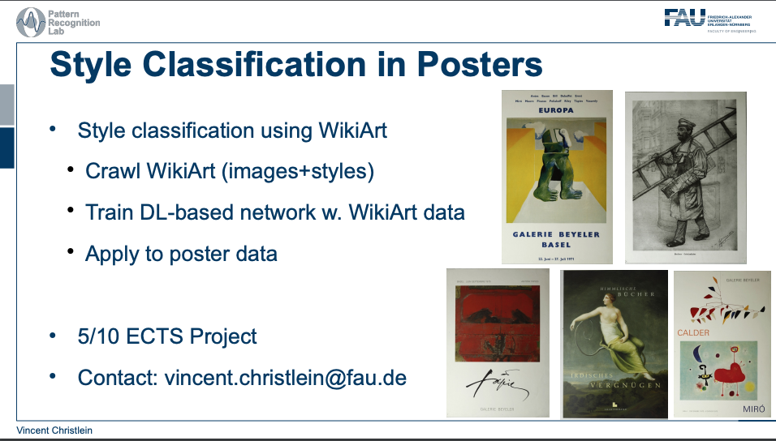

<div style="background-color:white">
  <div align="center">
    
    <hr>
    <h1 style="color:black">Style Classification in Posters<h1>
    <h3 style="color:black">Tim Löhr<h3>
    
  </div>
  <hr>
  <div style="background-color:white">
  <center>
  
  </center>
  </div>
</div>


## Abstract
Digitalization, Big Data and data collection is the keyword of many companies nowadays. Even museums digitize their artworks. A local museum from Bayreuth photographed 17786 posters showing invitations to exhibitions or advertising for specific events. Our department received this data to find patterns in it. More specifically, one shall order the posters in clusters to sort them logically.
Furthermore, if there is a new poster, the clustering should present all posters with similar attributes. Since how to do it was relatively open, I tried four different methods to cluster the posters. First, I used a supervised approach with a neural network and another dataset from WikiArt to perform Transfer Learning. The following two approaches are based on the text printed on the posters. I extracted the text and first performed clustering with the BERT Topic Modeling approach, then with the LDA Topic Modeling approach. Lastly, I focused on the image by extracting the features with a pre-trained neural network and then performing PCA and K-Means to find a pre-defined number of clusters. The three unsupervised approaches produced some output that is workable but is not satisfactory enough.


### Structure

```

+-- Code
|   +-- Notebooks                        
|   |    +-- EDA.ipynb
|   |    +-- Deep_Learning_Pipeline.ipynb                         # Classification Model 
|   |    +-- easyOCR.ipynb
|   |    +-- Unsupervised Clustering - BERT Topic Modeling.ipynb
|   |    +-- Unsupervised Clustering - BERT Transformer.ipynb
|   |    +-- Unsupervised Clustering - Image Clustering.ipynb
|   |    +-- Unsupervised Clustering - LDA Topic Modeling.ipynb
|   +-- Scripts                        
|   |    +-- augmentation.py
|   |    +-- data.py
|   |    +-- easyocr.py                                           # Used for the Streamlit Web App
|   |    +-- notebook_scripts.py
|   |    +-- training.py
|   |    +-- image_clustering.py                                  # Used for the Streamlit Web App
|   |    +-- topic_clustering.py                                  # Used for the Streamlit Web App
|   |    +-- utils.py
+-- Data                      
|   +-- PlakateBayreuth                                            # The Original provided Dataset with 17756 posters
|   +-- wikiart                                                    # The scraped wikiart Dataset
|   +-- corpus_topics.csv                                          # Used for the Streamlit App
|   +-- labels.csv                                                 # For the Classification Deep Learning Pipeline
|   +-- poster_text.csv                                            # The full text of the easyOCR processed posters of PlakatBayreuth
|   +-- train.csv                                                  # For the Classification Deep Learning Pipeline
|   +-- test.csv                                                   # For the Classification Deep Learning Pipeline
+-- Imgs             
|   +-- All images used in the Report  
| 
+-- Paper
|   +-- Final Report
|
+-- Logs_Local
|   +-- Tensorboard Logs from the Local training
|
+-- Logs_Server
|   +-- Tensorboard Logs from the Server training
|
+-- Models
|   +-- image_clustering_model.h5                                 # Used for the Streamlit App - Image Clustering
|   +-- pca.pkl                                                   # Used for the Streamlit App - Image Clustering
|   +-- kmeans.pkl                                                # Used for the Streamlit App - Image Clustering
|   +-- topic_model.sav                                           # Used for the Streamlit App - LDA Topic Modeling 
|   +-- model_local.ckpt                                          # Classification Model - Locally trained
|   +-- model_server.ckpt                                         # Classification Model - Locally trained
|   
+-- requirements.txt                    
+-- README.md
+-- .gitignore    
+-- app.py                                                        # The Streamlit App          

```
## Links to Ressources

- Final Report as [PDF](https://github.com/Mavengence/Machine_Learning_in_the_Industry_4.0_Seminar_SS2020.FAU/blob/master/Paper/L%C3%B6hr_Tim_MADI40SS20_paper.pdf)

## Ressources
- PyTorch: https://pytorch.org/
- PyTorch Lightning: https://www.pytorchlightning.ai/
- Kornia: https://kornia.github.io/
- Streamlit: https://streamlit.io/
- Wikiart: http://wikiart.org/
- Wikiart Scraper: https://github.com/lucasdavid/wikiart
- FAU Pattern Recognition Lab: https://www5.cs.fau.de/

### Prerequisites

```
The dependencies to this project are stored in the file:
   - requirements.txt

I use python version 3.7.4
```

## How to Use

### Classification

Go into the Code and then Scripts folder
The two parameters:

- batch_size (recommended 32-256)
- epochs (recommended more than 50)

```
  python training.py --batchsize 256 --epochs 100
```

The PyTorch Pipeline will start training based on:

- labels.csv
- train.csv
- test.csv

Train and Test have already been stratified in split in the correct way. Labels defines the 20 most common labels.

## Topic Modeling with LDA, Image Clustering and BERT Topic Modeling

```
  jupyter notebook
```

type this command into your console while being in the right folder, then you can open the jupyter notebooks inside the Notebooks folder.

Important: The .py files in the Scripts folder (e.g. easyocr.py) are designed for the webapp with Streamlit (app.py) and therefore cannot be used alone.

## Author

* **Tim Löhr** - If you have questions you can contact me under timloehr@icloud.com

## License

Copyright (c) 2021 University of Erlangen-Nuremberg, Pattern Recognition Lab

Permission is hereby granted, free of charge, to any person obtaining a copy
of this software and associated documentation files (the "Software"), to deal
in the Software without restriction, including without limitation the rights
to use, copy, modify, merge, publish, distribute, sublicense, and/or sell
copies of the Software, and to permit persons to whom the Software is
furnished to do so, subject to the following conditions:

The above copyright notice and this permission notice shall be included in all
copies or substantial portions of the Software.

THE SOFTWARE IS PROVIDED "AS IS", WITHOUT WARRANTY OF ANY KIND,
EXPRESS OR IMPLIED, INCLUDING BUT NOT LIMITED TO THE WARRANTIES OF
MERCHANTABILITY, FITNESS FOR A PARTICULAR PURPOSE AND NONINFRINGEMENT.
IN NO EVENT SHALL THE AUTHORS OR COPYRIGHT HOLDERS BE LIABLE FOR ANY CLAIM,
DAMAGES OR OTHER LIABILITY, WHETHER IN AN ACTION OF CONTRACT, TORT OR
OTHERWISE, ARISING FROM, OUT OF OR IN CONNECTION WITH THE SOFTWARE OR THE USE
OR OTHER DEALINGS IN THE SOFTWARE.

## Acknowledgments

Thanks a lot to Vincent Christlein from the Pattern Recognition Lab for a really good supervising through all my project. 
